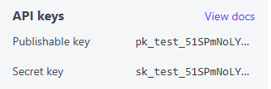

# Config
## Config local development
1. Configure Payment provider Stripe
   - Copy [.template-local.env](.template.env.local) to [.local.env](.env.local)
   - Login to https://dashboard.stripe.com/
   - Copy the secret key from Developers > API keys
     
   - Add this to .local.env
     ```
     STRIPE_SECRET_KEY=
     ```
     This configuration will be picked up from IntelliJ's local run configuration 
     (see [.run/SbEcomApplication local.run.xml](.run/SbEcomApplication%20local.run.xml))

## Config Test environment on Render.com
Configure sensitive runtime values (database credentials, API keys, profiles) in the Render service — do not bake secrets into the Docker image or commit them to the repo.

On Render (dashboard):
1. Open your service → Settings / Environment → Environment Variables.
2. Add variables you need (mark secrets as **Private / Secure**):
    - `JDBC_DATABASE_URL`
    - `JDBC_DATABASE_USERNAME`
    - `JDBC_DATABASE_PASSWORD`
    - `STRIPE_SECRET_KEY`
    - `SPRING_PROFILES_ACTIVE` = `prod`
    - Any other keys your app reads (e.g. `JWT_SECRET`, `MAIL_*`, etc.)
3. Do not set `PORT` manually — Render provides `PORT` to the container at runtime and the app should bind to it (the prod profile already uses `server.port=${PORT:8080}`).

## Config Environment Variables for Render.com on GitHub Actions
To deploy to Render from GitHub Actions, some secrets need to be added to the repository.
These secrets are used in the GitHub Actions workflow to authenticate and trigger deployments on Render.
 - `RENDER_SERVICE_ID` is the ID of the Render service you want to deploy to.
 - `RENDER_API_KEY` is the API key for the Render account that owns the service.

These keys can be found in the Render dashboard.

https://render.com/docs/deploy-hooks#deploying-from-an-image-registry

1. Create new Service on Render.com
   - Go to https://dashboard.render.com/
   - Create a new Project -> Use a 'Free Tier'
   - Create a new Environment, eg 'Test'
   - In this environment create a new Service ('Web Service')
     - Choose the provider, eg GitHub and the repostiory (eg sb-ecom)
     - Choose a 'Language' and 'Docker' as type
     - Choose a 'Free Tier' plan
     - Under 'Advanced' set 'Auto-Deploy' to 'Off'
   - Click 'Deploy'
   - Open the newly Created Service
   - Go to 'Settings' / Deploy Hooks and copy the value for the 'Deploy Hook Url'

2. In github (Source: https://render.com/docs/deploy-hooks#deploying-from-an-image-registry)
3. for the repository, go to 'Settings' / 'Secrets and Variables' / Actions
3. Create a new repository secret: 
   - Name: `RENDER_DEPLOY_HOOK_URL`
   - Paste the value from the Deploy Hook Url

# Deployment
Frontend Source: https://github.com/tomzi8571/sb-ecom-frontend
Frontend: https://sb-ecom-frontend.onrender.com/

## Run & Deploy (Docker) locally

This project includes a `Dockerfile` that builds the Spring Boot application and produces a runnable image that listens on port 8080 by default.

Local build and run (using `.local.env` for local values):

```bash
# Build the image locally
docker build -t sb-ecom:local .

# Run with environment variables from .env.local and publish port 8080 on the host
# This will make the app available at http://localhost:8080
docker run --rm --env-file .env.local -p 8080:8080 sb-ecom:local

# If you want a different host port (e.g. 5000):
docker run --rm --env-file .env.local -p 5000:8080 sb-ecom:local
```

Notes:
- The Docker image exposes port 8080 (see `EXPOSE 8080` in the `Dockerfile`). `EXPOSE` is metadata; `-p hostPort:containerPort` on `docker run` publishes the container port to the host.
- The project uses profile-specific configuration. To run with the `local` profile when running the jar directly:

```bash
# Using the packaged jar
java -jar target/sb-ecom-0.0.1-SNAPSHOT.jar --spring.profiles.active=local
```

Render deployment notes

- Render supplies a `PORT` environment variable to the container and expects the application to bind to that port. The production profile in this repo uses `server.port=${PORT:8080}` so it will bind to the `PORT` Render provides.
- If you deploy from a Docker image hosted on GitHub Container Registry (GHCR), ensure Render has access to the registry (add registry credentials in the Render dashboard). Alternatively, configure a Render service to build from the GitHub repo directly.
- The CI workflow in `.github/workflows/docker-deploy-render.yml` builds and pushes an image to `ghcr.io/<owner>/sb-ecom` and then triggers a Render deploy via the Render API. Make sure the repository secrets `RENDER_API_KEY` and `RENDER_SERVICE_ID` are set and that Render can pull from GHCR (or change the workflow to push to Docker Hub instead).

Optional Dockerfile tweak (safer port handling)

If you'd like the app to always pick up the `PORT` environment variable at the JVM level even when a properties file is missing, you can modify the `Dockerfile` entrypoint to pass `-Dserver.port=${PORT}`. For example:

```dockerfile
# inside Dockerfile runtime stage
ENV PORT=8080
ENTRYPOINT ["sh","-c","exec java -Dserver.port=${PORT} -jar /app/app.jar"]
```

This is optional because `application-prod.properties` already sets `server.port=${PORT:8080}`, but it can help in edge cases where the properties file is not loaded.

If you want, I can add the optional Dockerfile change now and update the CI workflow to pass the `PORT` env var explicitly when Render deploys (usually not necessary since Render sets `PORT`).
